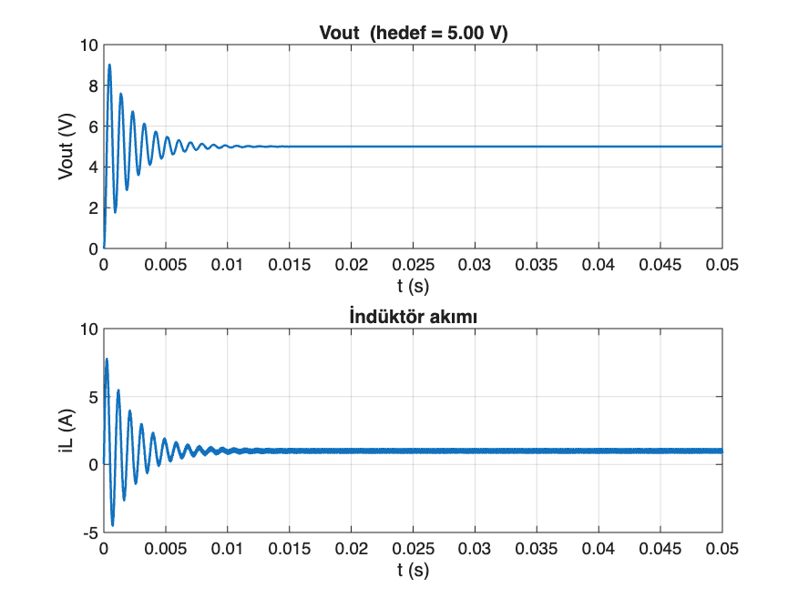

# Proje 2: Buck Converter — CCM/DCM Simülasyonu

Açık çevrim buck converter'ın Simulink'te durum-uzay (averaged) modeliyle
kurulması, CCM ve DCM modlarının simüle edilip karşılaştırılması.

MATLAB Online (basic) ortamında, Simscape Electrical olmadığı için model
`add_block` / `add_line` ile programatik olarak kurulmuştur.

## Aşama 1: CCM Doğrulaması

### Parametreler
| Vin | Vout (hedef) | D | L | C | R | f_sw |
|---|---|---|---|---|---|---|
| 12 V | 5 V | 0,4167 | 100 µH | 220 µF | 5 Ω | 100 kHz |

### Model
Durum değişkenleri iL ve Vout, iki diferansiyel denklemle tanımlanır:

    L · diL/dt   = s·Vin − Vout
    C · dVout/dt = iL − Vout/R

s(t), anahtarın PWM durumu (0 veya 1). Bloklar bu denklemleri
Gain/Sum/Integrator kombinasyonuyla çözer.

### Doğrulama
| Büyüklük | Teorik | Simülasyon | Fark |
|---|---|---|---|
| Vout (kararlı durum) | 5,000 V | 5,0000 V | ~0 |
| iL (ortalama) | 1,000 A | 0,999 A | ~%0,1 |
| Vout ripple (pp) | ~1,65 mV | 1,65 mV | ~0 |
| iL ripple (pp) | ~0,29 A | 0,292 A | ~%0,7 |

### Dosyalar
- `asama1-ccm/build_buck_model.m` — modeli kuran script
- `asama1-ccm/BuckConverterModel_v2.slx` — kurulan model
- `asama1-ccm/buck_vout_iL.png` — Vout ve iL dalga şekilleri

### Bilinen sınır
Model idealdir (anahtar/diyot kaybı, ESR yok) ve indüktör akımının
sıfırın altına inmesini engelleyen bir diyot kısıtı içermez. Bu yüzden
şu an yalnızca CCM davranışı gösterir; yük ne kadar hafifletilirse
hafifletilsin Vout = D·Vin'de sabit kalır. DCM, Aşama 2'de eklenecektir.

## Aşama 2: DCM Davranışı ve Karşılaştırma

İndüktör akımının (iL) sıfırın altına inmesini engelleyen bir kısıt
eklendi (Integrator bloğunda alt satürasyon limiti = 0), böylece
gerçek diyot davranışı taklit edilerek DCM gözlemlenebilir hale
getirildi.

### Karşılaştırma
İki farklı yük direnciyle aynı model çalıştırıldı:

| | CCM (R=5 Ω) | DCM (R=100 Ω) |
|---|---|---|
| Vout (kararlı durum) | 5,000 V | 7,358 V |
| iL (ortalama) | 1,000 A | 0,048 A |
| iL (minimum) | 0,853 A | 0,000 A |

R_kritik = 2·L·f_sw/(1−D) ≈ **34,29 Ω**. R=5Ω bu sınırın çok altında
olduğu için CCM'de kalındı; R=100Ω sınırın üstünde olduğu için DCM'ye
girildi.

### Temel bulgu
CCM'de Vout = D·Vin formülü geçerliyken (5V), DCM'de bu formül
geçerliliğini yitiriyor ve Vout hedefin üstüne çıkıyor (7,358V).
Bunun sebebi, hafif yükte indüktör akımının periyodun bir kısmında
sıfırda kalması ve volt-saniye dengesinin CCM'dekinden farklı
kurulmasıdır.

  

### Dosyalar
- `build_buck_model_dcm2.m` — CCM ve DCM'yi aynı script'te kuran ve karşılaştıran kod
- `BuckConverterModel_DCM.slx` — diyot kısıtlı model
- `buck_converter_ccm_dcm.png` — Vout ve iL karşılaştırma grafiği
