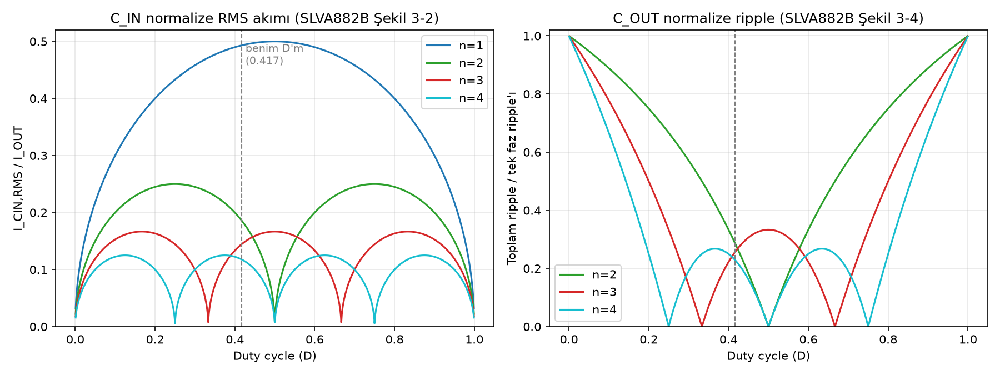
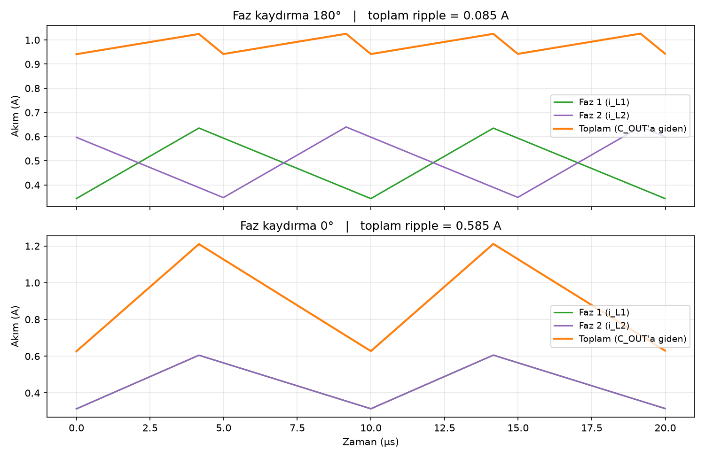
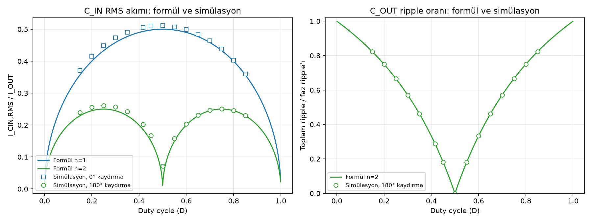
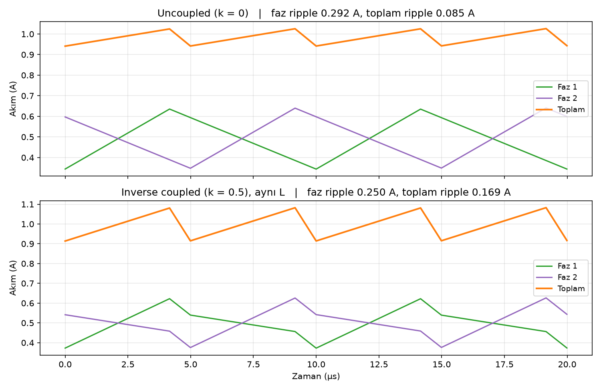
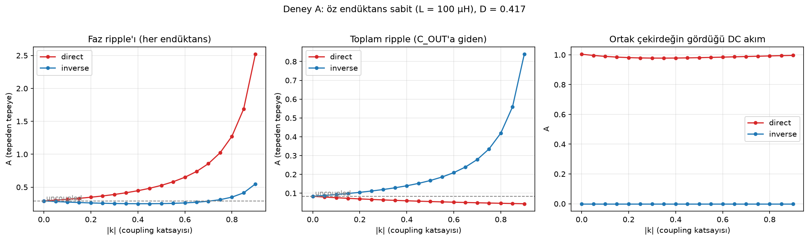
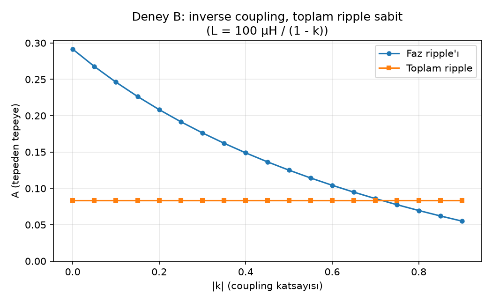

# Proje 3: İki Fazlı Interleaved Buck — Coupled ve Uncoupled Bobin Karşılaştırması

## Amaç

Bu projenin amacı, çok fazlı (multiphase) buck dönüştürücülerin temel kavramlarını ve TI uygulama notlarındaki grafiklerin arkasındaki formülleri gerçekten anlamaktı. Kaynak olarak hocamın tavsiye ettiği üç Texas Instruments dokümanını baştan sona okudum:

- **[SLVA882B]** C. Parisi, *Multiphase Buck Design From Start to Finish (Part 1)*
- **[SLYT449]** D. Baba, *Benefits of a multiphase buck converter*
- **[SLYY072]** K. Wong, D. Evans, *Merits of multiphase buck DC/DC converters in small form factor applications*

Çalışırken sistemi **bileşen bileşen** ele aldım: anahtarlama düğümü (switch node), bobin (inductor), giriş kondansatörü (C_IN), çıkış kondansatörü (C_OUT) ve çekirdek (core). Her grafikte "bu eğri neden bu şekilde?" sorusunu sordum ve her formülün nereden geldiğini, ne için kullanıldığını, sonucun tasarım açısından neden önemli olduğunu inceledim.

**Coupled / uncoupled karşılaştırması** bu üç makalede yok. Bu kısmı hocamın talebi doğrultusunda kendim ekledim; makalelerdeki interleaving ve geçici yanıt (transient) fikirlerini temel alarak genişlettim.

Simülasyon kodları yapay zekâ desteğiyle yazıldı. Kodlarda kullanılan bütün formülleri, yaklaşımları ve sonuç grafiklerini tek tek inceleyip makalelerdeki karşılıklarıyla eşleştirdim (aşağıdaki tabloya bakınız).

---

## Makale ↔ proje eşleştirmesi

| Kavram | Bu projede | SLVA882B | SLYT449 | SLYY072 |
|---|---|---|---|---|
| Faz kaydırma 360°/n | Tüm aşamalar (180°) | Bölüm 2, Şekil 2-1 | Şekil 1, 2 | Denklem 2 |
| Görev oranı D = V_OUT/V_IN | Tüm aşamalar | Denklem 1 altı | — | Denklem 1 |
| Tek faz ripple'ı ΔI_L | Aşama 2, 3 | Denklem 3, 5 | — | Denklem 3 |
| Ripple iptali (cancellation) | Aşama 2 dalga şekilleri | Bölüm 3.2, Şekil 3-3 | Şekil 4 | Şekil 2, 3 |
| Normalize C_OUT ripple | Aşama 1, 2 | **Denklem 2, Şekil 3-4** | Denklem 1–2, Şekil 3 | Denklem 5, Şekil 4 |
| Normalize C_IN RMS akımı | Aşama 1, 2 | **Denklem 1, Şekil 3-1, 3-2** | Denklem 3, Şekil 5 | Şekil 5 |
| Çıkış gerilim ripple'ı | Aşama 2 | Denklem 5 | — | Denklem 4 |
| Geçici yanıt, L_EQ = L/n | Aşama 3 (L_tr = L − M) | **Bölüm 3.4, Denklem 6–11, Şekil 5-2** | Load-transient bölümü | — |
| Çekirdek doyması (saturation) | Aşama 3 Deney A, 3. panel | Bölüm 5.2 | — | Giriş bölümü |
| Faz akımı dengeleme | Aşama 2 (faz ortalamaları) | Bölüm 4 | — | — |
| Verim ve faz sayısı | — (kavramsal) | Bölüm 3.3, Şekil 3-5, 3-6 | Şekil 6, 7 | — |
| Coupled bobin (M, k) | **Aşama 3** | *makalede yok* | *makalede yok* | *makalede yok* |

---

## Devre parametreleri

Proje 2'deki tek fazlı buck ile aynı değerler, faz başına:

| Parametre | Değer |
|---|---|
| V_OUT | 5 V |
| V_IN | 12 V (D taramalarında V_IN = 5 / D) |
| D | 0.417 (= 5/12) |
| L (faz başına) | 100 µH |
| C_OUT | 220 µF |
| R (yük) | 5 Ω → I_OUT = 1 A, faz başına 0.5 A |
| f_SW | 100 kHz (T = 10 µs) |
| Faz kaydırma | 180° |

## Dosyalar

| Dosya | Ne yapıyor |
|---|---|
| `simulasyon.py` | Ortak simülasyon çekirdeği: `dengeli_simule_et()` devreyi kararlı duruma (steady state) kadar çalıştırır, `olc()` ortalama, ripple ve RMS değerlerini çıkarır |
| `asama1_ti_formulleri.py` | SLVA882B Denklem 1 (C_IN RMS) ve Denklem 2 (C_OUT ripple) |
| `asama2_uncoupled.py` | Bağımsız bobinli 2 fazlı interleaved buck: 180° / 0° karşılaştırması ve D taraması |
| `asama3_coupled.py` | Coupled bobin: direct / inverse, k taraması, eşit çıkış ripple'ı karşılaştırması |
| `*.png` | Sonuç grafikleri |

## Çalıştırma

```bash
pip install numpy matplotlib
python asama1_ti_formulleri.py
python asama2_uncoupled.py
python asama3_coupled.py
```

---

## Aşama 1: TI formülleri

SLVA882B'deki iki normalize formülü D'nin ve faz sayısı n'nin fonksiyonu olarak çizdim. m = floor(n·D); yani her an ya m ya da m+1 faz açık (SLVA882B Bölüm 3.1). SLYT449'da aynı büyüklüğe "mp" deniyor.

**Giriş kondansatörü RMS akımı** (I_OUT'a normalize; SLVA882B Denklem 1, SLYT449 Denklem 3):

I_CIN,norm = √[ (D − m/n) · ((1+m)/n − D) ]

**Çıkış kondansatörü ripple akımı** (tek fazın ripple'ına normalize; SLVA882B Denklem 2, SLYT449 Denklem 2):

I_COUT,norm = n / (D·(1−D)) · (D − m/n) · ((1+m)/n − D)

Grafikleri yorumlarken çıkardığım sonuçlar:

- **Sıfır noktaları D = k/n:** Bu noktalarda her an sabit sayıda faz açık. Yükselen fazların eğimi, düşen fazların eğimini tam olarak götürüyor (SLVA882B Şekil 3-2 ve 3-4, SLYT449 Şekil 3 ve 5).
- **C_OUT eğrisinin uçlarda 1 olması:** Bu, ripple'ın büyük olduğu anlamına gelmiyor; "iptal yok" anlamına geliyor. D → 0'da yükselme eğimi (V_IN − V_OUT)/L, düşme eğimi V_OUT/L'den çok büyük olduğu için düşen fazlar yükseleni dengeleyemiyor. Bu uçlarda hem tek fazın hem de toplamın ripple'ı sıfıra gidiyor, oranları 1'e yaklaşıyor.
- **Formülün kendi kendine türetilmesi:** Denklem 2'yi, "açık fazların yükselişini topla, kapalı fazların düşüşünü çıkar, tek fazın ripple'ına böl" mantığıyla adım adım yeniden türettim. Bölme işlemi sayesinde L, f ve V_IN sadeleşiyor ve grafik her tasarım için geçerli oluyor.
- **SLYT449 ile çapraz kontrol:** Baba'nın Şekil 4'ünde D = 0.25, iki fazda bobin ripple'ı 2.2 A, kondansatör ripple'ı 1.5 A. Formül (1 − 2D)/(1 − D) = 0.667 veriyor: 2.2 × 0.667 ≈ 1.47 A ✓. Aynı makalede "%20 görev oranında %25 azalma" ifadesi de formülle tutuyor: (1 − 0.4)/(1 − 0.2) = 0.75 ✓.



---

## Aşama 2: Uncoupled (bağımsız bobinler)

### Deney A: 180° ve 0° karşılaştırması (D = 0.417)

Elle hesap, bobin kuralından: Δi = V_L · Δt / L, Δt = D/f = 4.17 µs.

- **Faz ripple'ı** (SLYY072 Denklem 3; SLVA882B Denklem 3'ün ΔI için çözülmüş hâli):
  ΔI_L = (V_IN − V_OUT) · D / (L·f) = 7 V × 4.17 µs / 100 µH = **0.292 A**
- **Toplam ripple, 180°:** Faz 1 yükselirken (+7 V) Faz 2 düşüyor (−5 V), net gerilim (V_IN − 2·V_OUT) = 2 V:
  ΔI_toplam = (V_IN − 2·V_OUT) · D / (L·f) = **0.083 A**
  Bu ifade, SLYY072 Denklem 5'in (I_OUTpp ≈ V_O/(f·L) · (1 − N·V_O/V_I)) N = 2 için birebir aynısı.
- **Toplam ripple, 0°:** Fazlar senkron, ripple'lar üst üste biniyor: 2 × 0.292 = **0.583 A**

| | 180° (interleaved) | 0° (senkron) |
|---|---|---|
| Faz ripple'ı | 0.292 A | 0.292 A |
| Toplam ripple | 0.083 A | 0.583 A |
| I_CIN,RMS / I_OUT (Denklem 1) | 0.19 | 0.49 |

Faz kaydırma, faz başına ripple'ı değiştirmiyor; ama C_OUT'a giden toplam ripple'ı 7 kat azaltıyor. Toplam ripple'ın frekansı 2·f_SW olduğu için çıkış gerilim ripple'ı (SLYY072 Denklem 4: ΔV ≈ ΔI / (8·f·C) + ΔI·ESR) daha da küçülüyor.



### Deney B: D taraması

V_OUT = 5 V ve R = 5 Ω sabit tutup V_IN = 5/D'yi değiştirdim. Böylece yük akımı her D'de 1 A kalıyor ve karşılaştırma adil oluyor. Her D'de ölçülen normalize değerleri Aşama 1'deki formül eğrisinin üstüne yerleştirdim; bu grafik SLVA882B Şekil 3-2 ve 3-4'ün simülasyonla yeniden üretilmiş hâli.



---

## Aşama 3: Coupled bobin (makalelerin ötesi)

Bu aşama TI dokümanlarında yok. Çıkış noktası SLVA882B Bölüm 3.4'teki fikirdi: geçici yanıtta bobinler paralel çalışınca eşdeğer endüktans L_EQ = L/n'e iniyor ve akım hızlı yetişiyor. Coupled bobin, bu "transient endüktansını" kararlı durumdaki ripple'dan **bağımsız** olarak küçültmenin bir yolu.

### Teori: ortak ve fark parçaları

İki bobin aynı çekirdeğe sarılınca karşılıklı endüktans (mutual inductance) M = k·L devreye giriyor. Inverse kuplaj için:

v₁ = L · di₁/dt − M · di₂/dt
v₂ = L · di₂/dt − M · di₁/dt

Denklemleri toplayıp çıkarınca iki ayrı hareket ortaya çıkıyor:

- **Ortak (common) hareket**, iki faz birlikte değişiyor: v₁ + v₂ = (L − M) · d(i₁ + i₂)/dt
- **Fark (differential) hareket**, fazlar zıt değişiyor: v₁ − v₂ = (L + M) · d(i₁ − i₂)/dt

Her faz akımı = ortak + fark, toplam akım = 2 × ortak. Yani **toplam ripple sadece ortak parçayı görüyor; fark parçası yalnızca fazların kendi ripple'ında var.** Uncoupled durumda D = 0.417'de faz eğiminin 6/7'si fark parçası, yani C_OUT'a hiç ulaşmayan kısım.

| | Ortak hareketin gördüğü L | Fark hareketinin gördüğü L | Çekirdekteki net akı ∝ |
|---|---|---|---|
| Uncoupled | L | L | — |
| Inverse | **L − M** | **L + M** | i₁ − i₂ |
| Direct | L + M | L − M | i₁ + i₂ |

Coupled bobin literatüründe bu iki endüktansa şu isimler veriliyor:

- **Transient endüktans:** L_tr = L − M. SLVA882B Bölüm 3.4 ve Denklem 6–11'deki L_EQ'nun karşılığı; yük sıçramasında akımın ne kadar hızlı yetiştiğini ve toplam ripple'ı belirliyor.
- **Kararlı durum endüktansı:** Faz ripple'ını, uncoupled bir bobin gibi veren eşdeğer değer (2 faz, D < 0.5):
  L_ss = (L² − M²) / (L − M · D/(1 − D))

Kapalı formüller (2 faz, inverse, D < 0.5):

ΔI_toplam = (V_IN − 2·V_OUT) / (L − M) × D/f

ΔI_faz = [ (V_IN − 2·V_OUT)/2 / (L − M) + (V_IN/2) / (L + M) ] × D/f

### Dalga şekilleri: aynı L ile uncoupled ve inverse (k = 0.5)



| | Uncoupled | Inverse, k = 0.5, aynı L |
|---|---|---|
| Faz ripple'ı | 0.292 A | 0.250 A |
| Toplam ripple | 0.085 A | 0.169 A |
| L_ss | 100 µH | ≈ 117 µH |
| L_tr | 100 µH | 50 µH |

Simülasyon ve kapalı formüller (0.250 A ve 0.167 A) birbirini tutuyor. Coupled durumda faz akımı her periyotta 4 parçalı bir şekil alıyor: Faz 1'in kendi anahtarı değişmese bile, Faz 2'nin anahtarlaması çekirdek üzerinden Faz 1'in eğimini değiştiriyor. Aynı L ile faz ripple'ı biraz düşüyor, ama L − M yarıya indiği için toplam ripple iki katına çıkıyor.

### Deney A: L = 100 µH sabit, k taraması (direct ve inverse)



- **Faz ripple'ı:** Direct'te fark hareketi L − M gördüğü için k arttıkça patlıyor (k = 0.9'da ≈ 2.5 A). Inverse'te önce düşüyor (en düşük ≈ 0.245 A, k ≈ 0.4); yüksek k'da ortak parça büyüdüğü için tekrar yükseliyor.
- **Toplam ripple:** Inverse'te ortak hareket L − M gördüğü için k arttıkça patlıyor (k = 0.9'da ≈ 0.83 A). Direct'te azalıyor.
- **Çekirdeğin gördüğü DC akım:** Direct'te DC akılar toplanıyor (≈ 1 A), inverse'te birbirini götürüyor (≈ 0). SLVA882B Bölüm 5.2'de anlatılan doyma (saturation) riski açısından inverse kuplaj, çekirdeğin çok daha küçük olabilmesini sağlıyor. Bu sonuç, fazların akımı eşit paylaşmasına dayanıyor; bu yüzden SLVA882B Bölüm 4'teki faz akımı dengeleme coupled bobinde daha da önemli hâle geliyor.

Bu deneyden çıkardığım sonuç: interleaved buck için direct kuplaj uygun değil. Inverse doğru seçim, ama L sabit tutulunca karşılaştırma adil olmuyor.

### Deney B: inverse, toplam ripple sabit (L = 100 µH / (1 − k))

L = 100 µH / (1 − k) seçimi L − M = L·(1 − k) = 100 µH'i sabit tutuyor. Böylece C_OUT her k'da uncoupled ile aynı ripple'ı görüyor ve sadece fark parçası küçülüyor.



| k | L | M | Faz ripple'ı | Toplam ripple |
|---|---|---|---|---|
| 0 | 100 µH | 0 | 0.292 A | 0.083 A |
| 0.5 | 200 µH | 100 µH | 0.125 A | 0.083 A |
| 0.9 | 1000 µH | 900 µH | 0.055 A | 0.083 A |

k ≈ 0.71'den sonra faz ripple'ı toplam ripple'ın altına iniyor. Fark parçası neredeyse yok olunca her faz yalnızca ortak parçayı taşıyor; toplam = 2 × ortak olduğu için toplam, fazın iki katına yaklaşıyor.

**Bedeli:** Sargı endüktansı k = 0.5'te 2 kat, k = 0.9'da 10 kat büyüyor. Bu, daha fazla sarım ve daha büyük DC direnç (DCR) demek. Ayrıca yüksek k'da L − M, k'daki küçük üretim sapmalarına çok hassas.

---

## Sonuç

- SLVA882B'nin normalize ripple formüllerini (Denklem 1 ve 2) simülasyonla yeniden ürettim; SLYT449 Şekil 4'teki sayısal örnekle de çapraz kontrol ettim.
- 180° faz kaydırma, faz başına ripple'ı değiştirmeden C_OUT'a giden ripple'ı D = 0.417'de 7 kat azaltıyor.
- Coupled bobin, faz ripple'ını belirleyen endüktans (L_ss) ile toplam ripple ve transient hızını belirleyen endüktansı (L_tr = L − M) birbirinden ayırıyor. Uncoupled bobinde bu ikisi aynı L'ye bağlı.
- Direct kuplaj interleaved buck'ta faz ripple'ını artırıyor ve çekirdeği DC akıyla yüklüyor.
- Inverse kuplajda L − M sabit tutulduğunda, C_OUT'un gördüğü ripple aynı kalırken faz ripple'ı k = 0.5'te %57, k = 0.9'da %81 azalıyor.

## Kaynaklar

Dokümanlar telif nedeniyle bu repoya eklenmedi; TI'nin sitesinden indirilebilir.

1. C. Parisi, *Multiphase Buck Design From Start to Finish (Part 1)*, Texas Instruments Application Report, SLVA882B, 2017 (rev. 2021). https://www.ti.com/lit/pdf/slva882
2. D. Baba, *Benefits of a multiphase buck converter*, Texas Instruments Analog Applications Journal, SLYT449, 1Q 2012. https://www.ti.com/lit/pdf/slyt449
3. K. Wong, D. Evans, *Merits of multiphase buck DC/DC converters in small form factor applications*, Texas Instruments White Paper, SLYY072, 2015. https://www.ti.com/lit/pdf/slyy072
